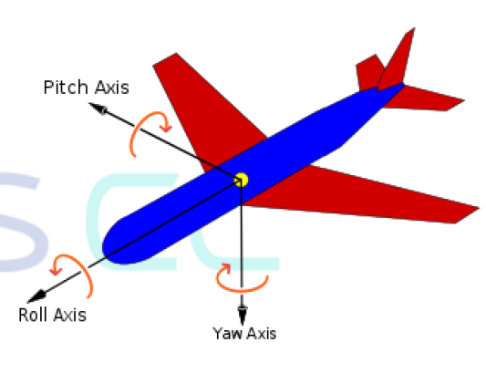
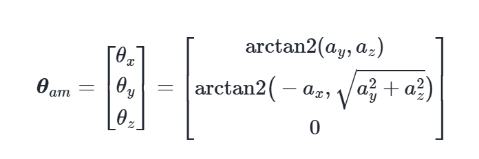
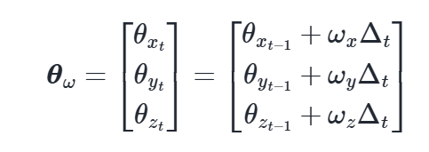
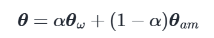

# Sistema de Cálculo de Pose

Este repositório contém a implementação de um sistema de estimação de pose, desenvolvido em plataforma STM32 NUCLEO-F767ZI. O sistema utiliza um sensor MPU6050 para o cálculo das acelerações e velocidades angulares, além de um display SSD1306 para visualização dos valores desejados. O fundamento dessa tarefa é a utilização do protocolo de comunicação I²C entre os sensores e o microcontrolador.
  
Este repositório contém a implementação de um sistema de estimação de pose, desenvolvido em plataforma STM32 NUCLEO-F767ZI. O sistema utiliza um sensor MPU6050 para o cálculo das acelerações e velocidades angulares, além de um display SSD1306 para visualização dos 

## Fundamentos Teóricos

O sensor MPU6050 é conhecido por sua ampla utilização em drones, a fim de fazer a estimação de pose. Uma implementação comum deste sensor neste contexto é o cálculo dos ângulos que um drone/aeronave pode fazer em torno dos três eixos cartesianos: Pitch, Roll e Yaw. 

  

O MPU6050 é constituído por 2 elementos fundamentais: o acelerômetro e o giroscópio. O acelerômetro é encarregado de calcular quantos "g" (aceleração da gravidade) cada um dos 3 eixos cartesianos possui em cada momento, podendo variar entre 0 e 1. O giroscópio possui o papel de calcular as velocidades angulares em cada um dos mesmos 3 eixos cartesianos, retornando valores em rad/s (radianos por segundo). Então, a seguinte pergunta deve ser feita: Como, então, calcular os ângulos de Pitch, Roll e Yaw com esses dados? A resposta é: utilizando um filtro complementar! 

Um filtro complementar conjuga os valores do acelerômetro e do giroscópio, lhes atribuindo uma porcentagem que representa o grau de confiança em cada um destes sensores, isto é, é calculda uma média ponderada dos sensores. O primeiro passo é a conversão dos valores de aceleração calculados pelo acelerômetro para ângulos. Para tanto, utilizamos o seguinte sistema: 

  

Em seguida, devemos converter os valores de velocidades angulares calculados pelo giroscópio também para valores angulares:

  

Com os valores angulares calculados para cada sensor, podemos conjugá-los e formar a equação característica do filtro complementar com a qual calcularemos os ângulos de Pitch e Roll, em que 	$\alpha$ representa a porcentagem de confiança concedida para cada sensor (0 < $\alpha$ < 1):

  

O ângulo de Yaw é mais complexo para se calcular, haja vista que, em termos de hardware, faz-se necessário a utilização de um magnetômetro (bússola) para sensibilizar o sistema em torno do eixo deste ângulo.

## Hardware

Para este sistema, o hardware é constituído por:

* Placa de desenvolvimento STM32 NUCLEO-F767ZI
* Sensor MPU6050 (Acelerômetro e Giroscópio)
* Display OLED SSD1306

  

